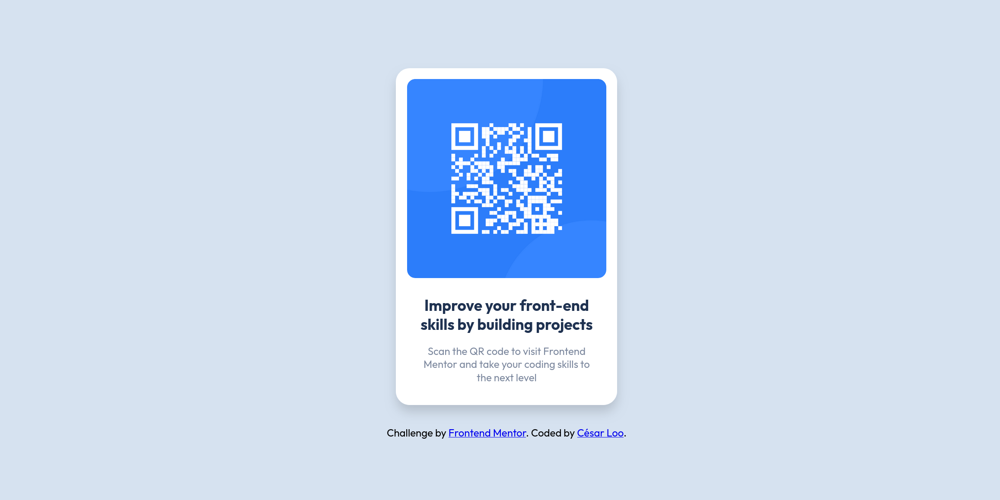

# Frontend Mentor - QR code component solution

This is a solution to the [QR code component challenge on Frontend Mentor](https://www.frontendmentor.io/challenges/qr-code-component-iux_sIO_H).

## Table of contents

- [Overview](#overview)
  - [Screenshot](#screenshot)
  - [Links](#links)
- [My process](#my-process)
  - [Built with](#built-with)
  - [What I learned](#what-i-learned)
  - [Continued development](#continued-development)
  - [Useful resources](#useful-resources)
- [Author](#author)
- [Acknowledgments](#acknowledgments)

## Overview

### Screenshot

### Links

- Solution URL: [https://www.frontendmentor.io/solutions/qr-code-component-MXpagpyk9C](https://www.frontendmentor.io/solutions/qr-code-component-MXpagpyk9C)
- Live Site URL: [https://cesarlooe.github.io/frontend-mentor-challenges/qr-code-component/](https://cesarlooe.github.io/frontend-mentor-challenges/qr-code-component/)

## My process

### Built with

- Semantic HTML5 markup
- CSS custom properties
- Flexbox
- CSS Grid

## Author

- Website - [César Loo](https://github.com/cesarlooe)
- Frontend Mentor - [@cesarlooe](https://www.frontendmentor.io/profile/cesarlooe)
- Twitter - [@cesarlooe](https://www.twitter.com/cesarlooe)
